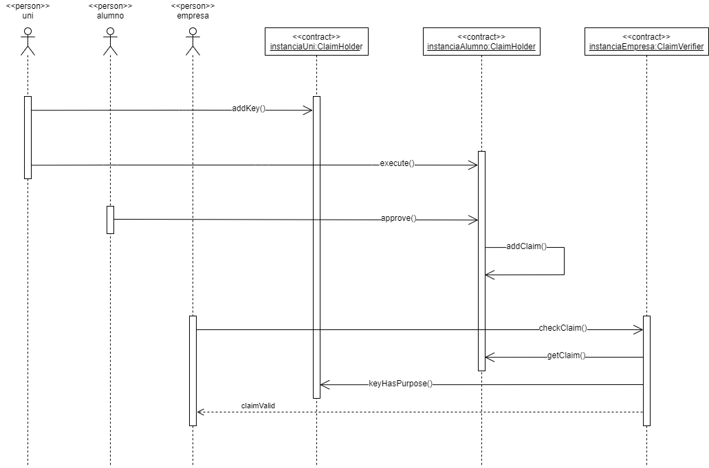
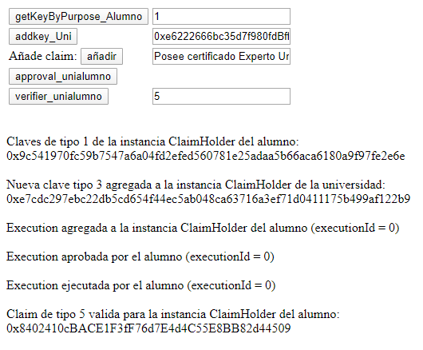

# IdDigital_ERC725-ERC735

This is an academic certification DApp based on the [ERC725(v1) and ERC735 standards by Origin Protocol](https://github.com/OriginProtocol/origin-playground/tree/master/contracts).

## Description

The DApp allows the academic institution to emit claims to the students representing their degrees. The students can accept or reject those claims and any external party who trusts the academic institution can certify a claim holded by a student.  

  

## Getting Started

### Dependencies

We will use [Ganache CLI](https://github.com/trufflesuite/ganache-cli) as our testnet blockchain builder.

### Deploying

We will deploy the instances of our contract from [Remix](https://remix.ethereum.org/) using three different accounts provided by Ganache CLI:
* An instance of ClaimHolder.sol that represents the student (accounts[0]).
* An instance of ClaimHolder.sol that represents the academic institution (accounts[1]).
* An instance of ClaimVerifier.sol that represents the external party (accounts[2]). We will provide the address of the second instance of ClaimHolder.sol as the parameter for the constructor of ClaimVerifier.sol. This connection identifies the academic institution as trustworthy.  

Finally we will copy the addresses of the deployed contracts and we will paste them in our index.html file:
```
var contrato_alumno = "<address of ClaimHolder instance that represents the student>";
var contrato_uni = "<address of ClaimHolder instance that represents the student>";
var contrato_empresa = "<address of ClaimVerifier instance that represents the external party>";
```

### Using DApp

* When we deploy our instances of ClaimHolder.sol a management key is generated automatically for each of them. The button GETKEYBYPURPOSE_ALUMNO will return that management key for our student when provided with the correct purpose (MANAGEMENT_KEY=1).  
* The button ADDKEY_UNI adds a new claim signer key (CLAIM_SIGNER_KEY=3) to the academic institution. It's always a good idea to link a new address for each purpose and Ganache CLI provides us with a bunch of unused accounts to choose from.
* The button AÑADIR adds the provided claim to the student ClaimHolder instance from the academic institution ClaimHolder instance. The claim type 5 is proposed as a standard for university degree in this DApp. This claim will be added to the student ClaimHolder instance via the proxy that the ERC725 standard implements and it will wait there for its approval.
* The button APPROVAL_UNIALUMNO approves the added claim.
* Finally, the button VERIFIER_UNIALUMNO verifies from the ClaimVerifier instance that the student holds the given claim type.  

  

## Acknowledgments

This DApp was developed as a project for the course [Experto Universitario en Desarrollo de Aplicaciones Blockchain from UNIR](https://www.unir.net/ingenieria/curso-blockchain-technology/549203598650/) and the code is strongly based on the template provided in that course.
